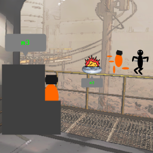

# Lethal Company: Remote Mine Detonation
A Lethal Company mod that replaces the ship terminal's ability to disable landmines with the ability to instead detonate them.

## Description
Save (or screw) your crewmates with remote-controlled landmines!

Simply enter the landmine's code into the terminal just as you would to toggle it off.
Instead of disabling the mine as usual, it will immediately explode. Time this well and you just might kill a thumper (or the mechanical keyboard user)!

## Compatibility
This is a client-side mod. Anyone with the mod will detonate landmines in the terminal. Anyone without the mod will disable them as usual.
- Supported game versions:
	- v45
	- Older versions probably work just fine, but I haven't tried any.
- Works well with:
	- [SuperLandmine](https://thunderstore.io/c/lethal-company/p/phawitpp/SuperLandmine/)
	(at least as of version 1.1.3)
- Not compatible with:
	- Unknown. If any problems arise, please create an issue on this mod's GitHub (linked below).

## Website
Feel free to check out the (very simple) [source code on GitHub](https://github.com/jacksonb-cs/RemoteMineDetonation)! Please create a GitHub issue if any problems arise.

## Attributions
- Landmine graphic captured in-game
- Explosion graphic used in icon: <a href="https://www.flaticon.com/free-icons/explosion" title="explosion icons">Explosion icons created by Good Ware - Flaticon</a>
